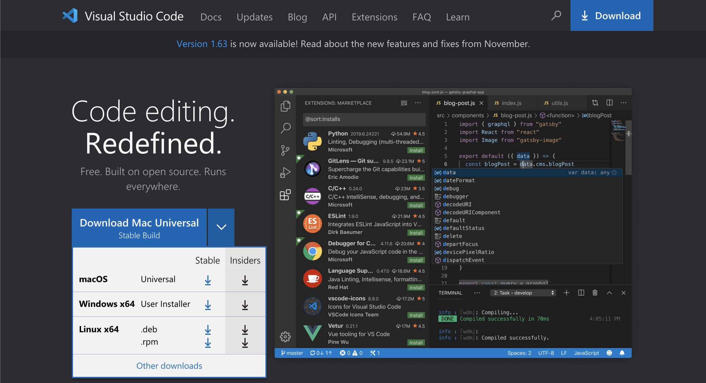
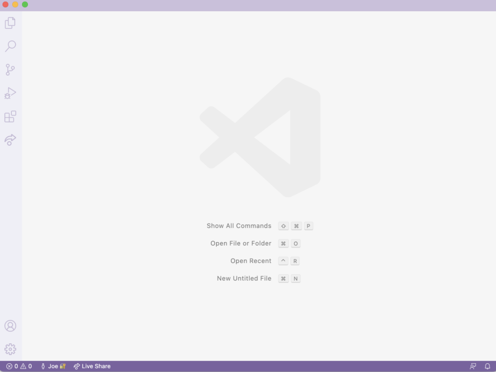
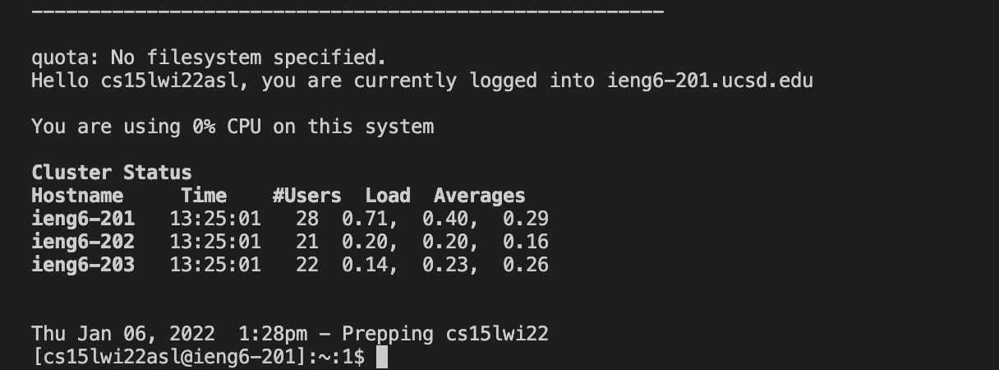
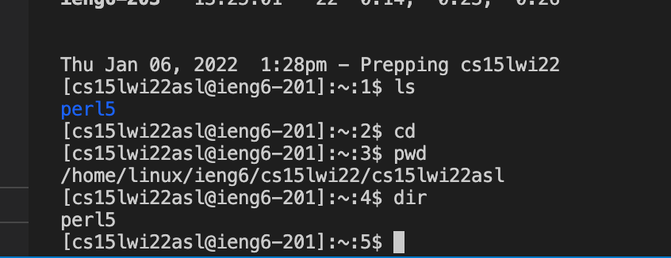
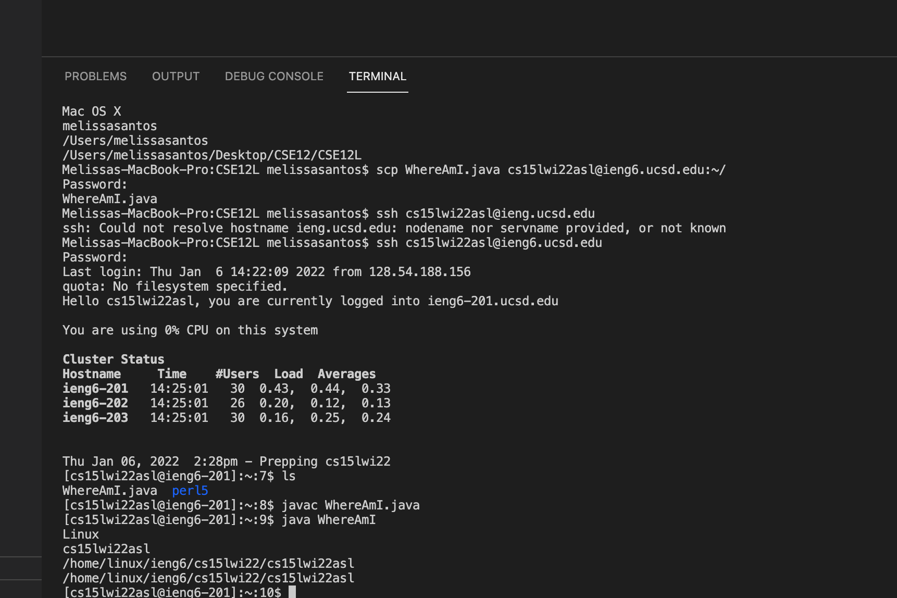
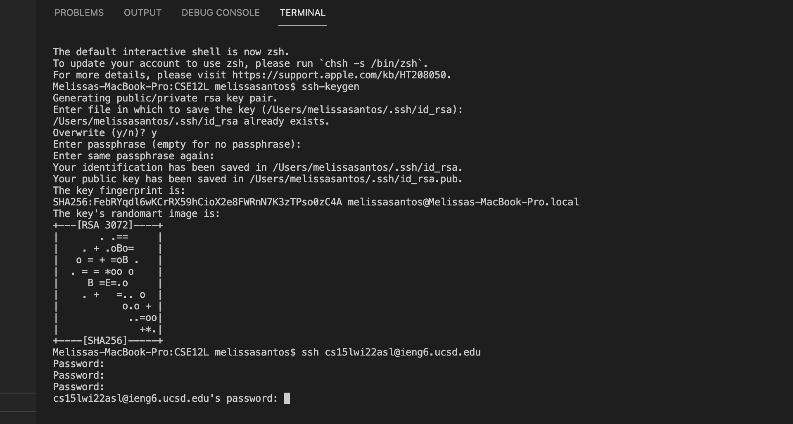
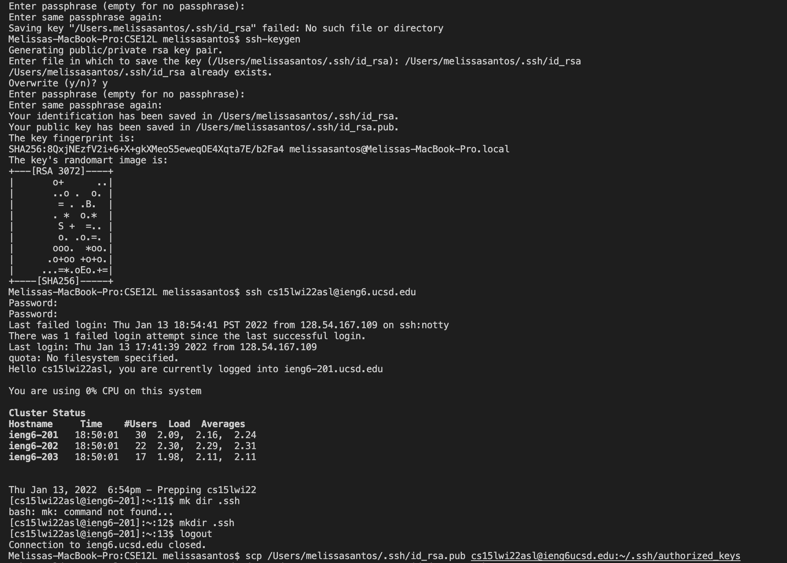

# Hello! Lets learn about remote access.
## Step 1: Installing Visual Studio Code:
-To install Visual Studio Code you can go to the website ([VSCODE](https://code.visualstudio.com) ). From there you should be able to download the version that best fits your operating system, like OSX(for Macs) and Windows(for PCs).



-Once it is installed a window should pop up that looks similar to this. The look may vary depening on the system and settings but if it has the same side bar menu and information in the middle you are good to go 👍



## Step 2: Remotely Connecting 💻 🖥
In this step we will see how to use VScode to connect to a remote computer via the internet.For this you will need access to your course-specific account which can be found here: [account](https://sdacs.ucsd.edu/~icc/index.php.)

On VScode we will be connecting to a remote computer using VScode's remote option. To do so  open the terminal and type : `` ssh user@hostname`` in this case it will be similar to `ssh cs15lwi22zz@ieng6.ucsd.edu` but the "zz" should be replaced by the letter in your course-specific account.
Once that is done for first time you log into the system a message will be prompted that looks like this: 
````
⤇ ssh cs15lwi22zz@ieng6.ucsd.edu
The authenticity of host 'ieng6.ucsd.edu (128.54.70.227)' can't be established.
RSA key fingerprint is SHA256:ksruYwhnYH+sySHnHAtLUHngrPEyZTDl/1x99wUQcec.
Are you sure you want to continue connecting (yes/no/[fingerprint])?
````

When this message is prompted I would normally say  yes. So type yes and press enter to continue. Once you do that it will ask you to put in the password for your account(Note: when typing in the password you will not be able to see what you type. That is okay! 😃)
Once you are logged in there should be a message prompted that looks like this towards the bottom: 



This means that you are now connected to a computer in the CSE Basement(remote server) YAYYY!!🎉🎉 Now we get to move onto the next step!

## Step  3: Running Commands!

There are many commands one can run to complete specific tasks. For right now we will just keeo it simple and use a few tasks. Lets try using ls,cd, pwd, and dir. 
1. ```ls```: lists the files and directories
2. ```cd```: this changes the current directory you are in
3. ```pwd```: shows you the full addres of the current directory
4. ```dir```: gives you the current directory

When you are done excuting these commands it could somewhat look like this:


Now to log out of this remote server you can use:
```Crtl-D ```

Lets move on to the next step!
## Step 4: Moving Files with `scp`

In this step we will be learning a crucial part that is needed when working remotely. This is being able to copy files back and forth between computers. To do so you will be using the command `scp` which will always be ran from your computer(make sure you are not running it on the remote server). First, lets create a file named WhereAmI.java and write this into it:
````
class WhereAmI {
  public static void main(String[] args) {
    System.out.println(System.getProperty("os.name"));
    System.out.println(System.getProperty("user.name"));
    System.out.println(System.getProperty("user.home"));
    System.out.println(System.getProperty("user.dir"));
  }
}
````
From here you can compile it using `javac WhereAmI.java` and run it using `java WhereAmI`. Once that is done in the terminal you can run this: `scp WhereAmI.java (insert your course-specific account )~/`. Then you should be prompted to put in your password. From here log back into ssh using your course-specific account and type in the command `ls` now you should be able to see the file in your directory!! It will look like this:



## Step 5: Setting an SSH Key
When logging in or running `scp` we always have to input our password which can become really frustrating and time consuming. Well luckily there is an easy fix which is by creating SSH Keys! In  order to do this you should run ```ssh-keygen``` this to set it up: 


This has now created two files 
1. the private key(id_rsa)
2. public key (id_rsa.pub)

Now we need to copy the public key to the `.ssh` directory using your course-specific account. Then follow these steps:
````
$ ssh cs15lwi22zz@ieng6.ucsd.edu
<Enter Password>
# now on server
$ mkdir .ssh
$ <logout>
# back on client
$ scp /Users/joe/.ssh/id_rsa.pub cs15lwi22@ieng6.ucsd.edu:~/.ssh/authorized_keys
# You use your username and the path you saw in the command above
````
With everything together it should look like this:



YOU'VE DONE IT!!🎉🎉 Now you should be able to ssh or scp from your computer to the server without entering your password!!

## Part 6: Optimizing Remote Running
Here are some tips on how to be efficient when running through this whole process.


1. Use the keyGen which saves time from inputing your password
2. scp the file up to your directory at the server
3. When running and compiling multiple times use the up arrow to recall these commands
4. When making changes to files use the keyboard shortcut Command + s to save the file easily 

Using these tips I was able to run the files remotely using  11 KeyStrokes:

First I used the up arrow on my keyboard to log in since I had previously ran that command. 
So that was 1 key stroke used plus the keystroke to enter. You then also have to press enter for your password so thats another key stroke.
Then, I compiled the Where Am I file which is a total of 2 key strokes because I copied and pasted it in. From there I used a semicolon
to also run the java file(copied and pasted it in)with compiling the file so it runs in one command and the. So we have 3 + 3 +1 +3 + 1 which is 11 keystrokes.


# That's it enjoy!!
