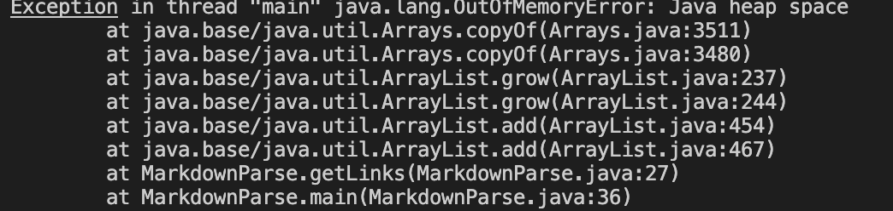
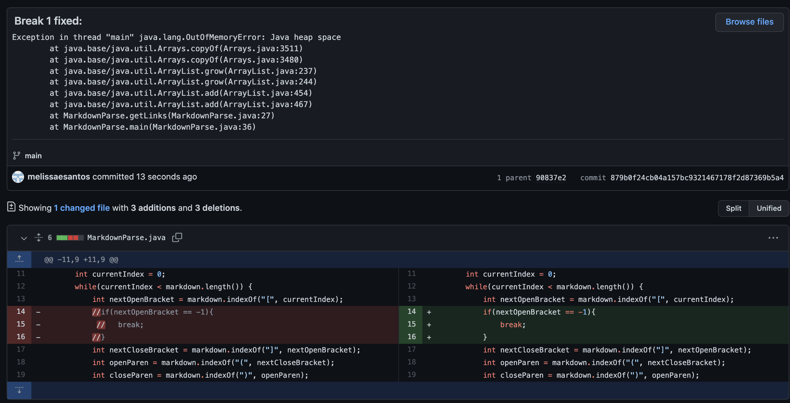
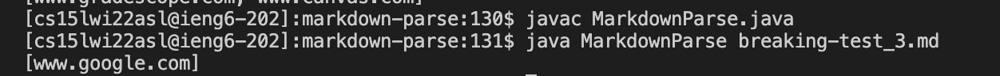
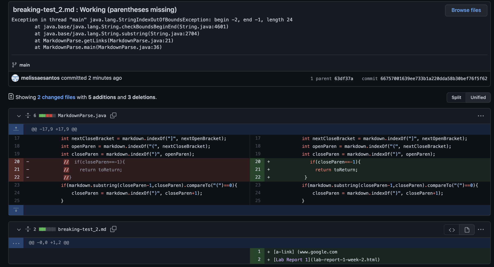
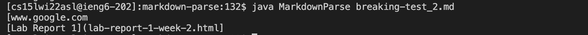
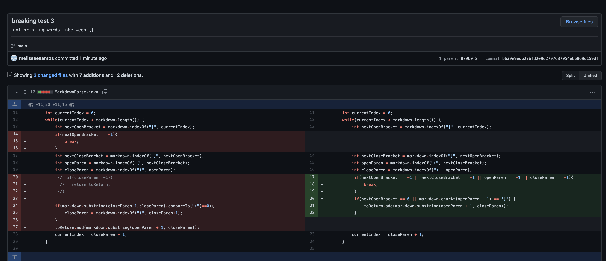

# Lab Report 2
Let's do some debugging!

---
Change 1:

---

This change was made because of this 
[failure-inducing input](https://github.com/melissaesantos/markdown-parse/blob/b639e9edb27bfd209d2797637054eb6869d159df/breaking-test.md):


When compiling `javac MarkdownParse.java` and running `java MarkdownParse breaking-test.md`  this error  was shown:

To fix this issue I added these few lines of code:


-The failing inducing input contains `[a-link] (www.gooog()le.com)` but due to the extra parantheses in the middle of google it would show the symptom (OutofMemoryError Exception). To fix this I added a break statement inside of an if statement so that once it meets the condition it would break out of the while loop. Once it breaks out of the while loop the bug is fixed and it produces the correct output.



---
Change 2:

---

This 2nd change was made because of this [failure-inducing input2](https://github.com/melissaesantos/markdown-parse/blob/b639e9edb27bfd209d2797637054eb6869d159df/breaking-test_2.md):

Due to this input when we compile `javac MarkdownParse.java` and run `java MarkdownParse breaking-test_2.md`  this error message was given:
```
`Exception in thread "main" java.lang.StringIndexOutOfBoundsException: begin -2, end -1, length 24
        at java.base/java.lang.String.checkBoundsBeginEnd(String.java:4601)
        at java.base/java.lang.String.substring(String.java:2704)
        at MarkdownParse.getLinks(MarkdownParse.java:21)
        at MarkdownParse.main(MarkdownParse.java:36)
`
```


-The failing inducing input2 contains `[a-link] (www.google.com Lab Report 1`
since it is missing the parantheses it shows the symptom(StringIndexOutOfBoundsException). To fix this bug I put inputted those two lines of code which checks if there is no closing bracket. Now it simply returns what was inputted. 



---
Change 3

---

This 3rd change was made because of this [Failure-inducing input3](https://github.com/melissaesantos/markdown-parse/blob/b639e9edb27bfd209d2797637054eb6869d159df/breaking-test_3.md)

because of this input when we compile `javac MarkdownParse.java` and run `java MarkdownParse breaking-test_3.md` it only outputs `[]` when it should output `[www.google.com]`. 


-The failing inducing input contains : `[google]random hello ]good bye (www.google.com)`.Since the symptom tells us that it doesn't output what is in the failing inducing inputI added those lines of code to fix the bug so that it can produce the correct output. Once this code was added it fixed the bug, no longer got the symptom, and it gave the correct output.

