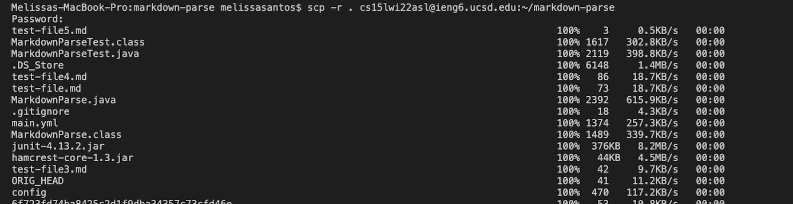
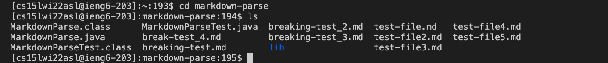
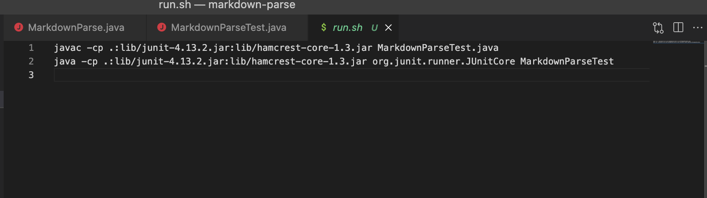
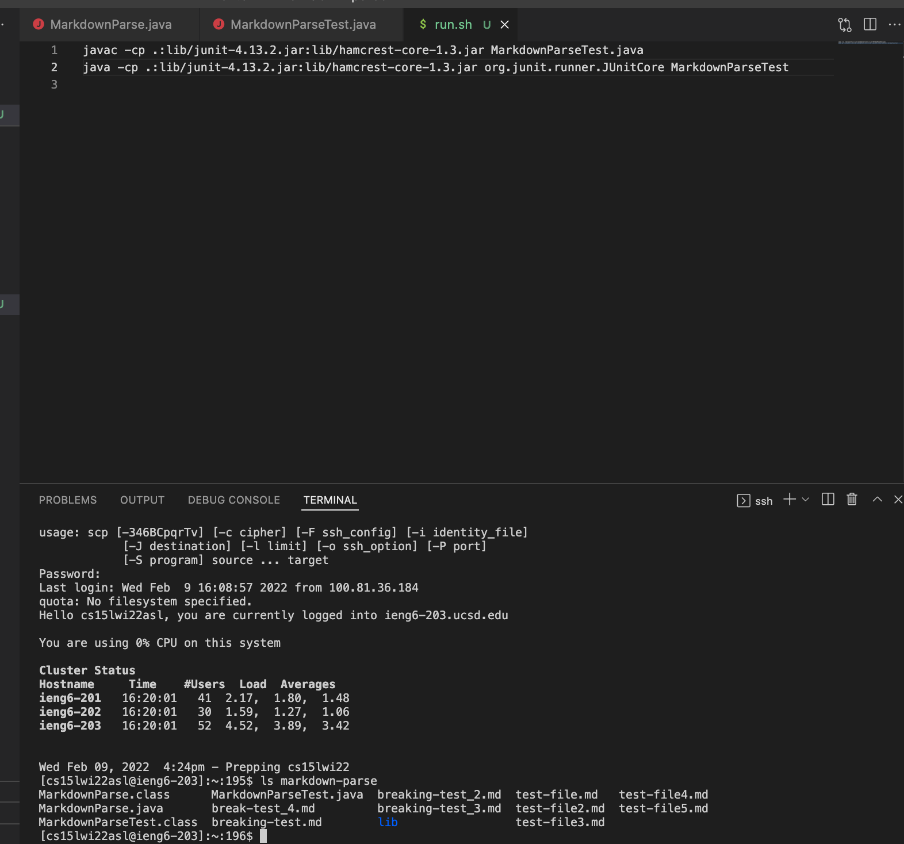

# Lab Report 3

Lets copy whole directories with ```scp -r```

---
1. copying all of markdown-parse directory to my ieng6 account
---
To do this I used the following code:
```
$ scp -r . cs15lwi22asl@ieng6.ucsd.edu:~/markdown-parse
```
from here you will be directed to put in your password.
It should look like this:


Once that is done lets move on to step 2.

---
2.  Logging into your ieng6 acoount 
---
Logging into your ssh it should look like this when you check if everything has been copied over.


After checking this you can compile and run your tests which gives you this:

Once that is done lets see if we can make it easier to run and compile the files.


---
3. Lets make it easier to run and compile
---
This is my single command line code that I used to copy the whole directory and run the tests in one line:
```
scp -r .ieng6:markdown-parse;ssh cs15lwi22asl@ieng6.ucsd.edu ;run.sh
```
Explanation:
In order to run this in one comand line you can use the short name ieng6 to copy over the directories. Then I created a file run.sh that contains these commands:


So when I run it all in one line then it also compiles and run the tests and once typing out the onliner it looks like this:

