# Lab Report 4
Before  we begin here is the link to my repository of MarkdownParse:
[Melissa MarkdownParse](https://github.com/melissaesantos/markdown-parse)

Here is the link for the MarkdownParse I reviewed:[reviewed MarkdownParse](https://github.com/merrickqiu/markdown-parse)

---
Snippet 1
---

For this Snippet I checked what the expected output is which showed:

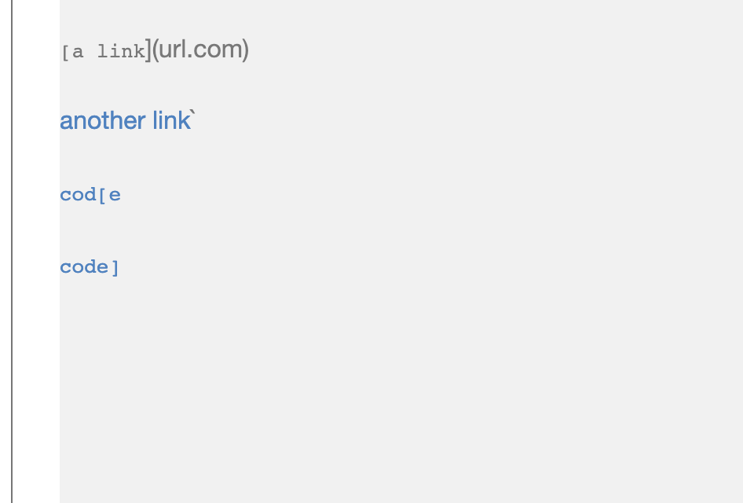

From here I was able to tell that the expected links would be:
```
"`google.com"
"google.com"
"ucsd.edu"
```
On both my version of MarkdownParse and the one I reviewed I created this test to see if we got the expected output:

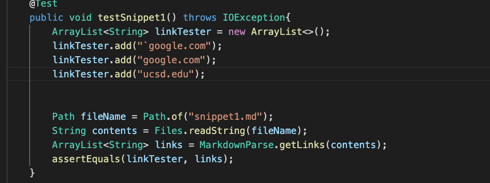

For my version of Markdownparse my tester failed and was this:
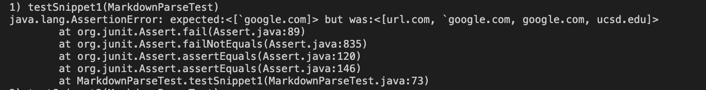


The result for the version I reviewed this was the result of the tester:
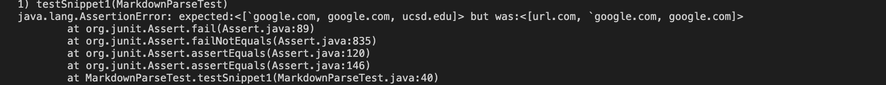


---
Snippet 2
---

For this Snippet I checked what the expected output is which showed:

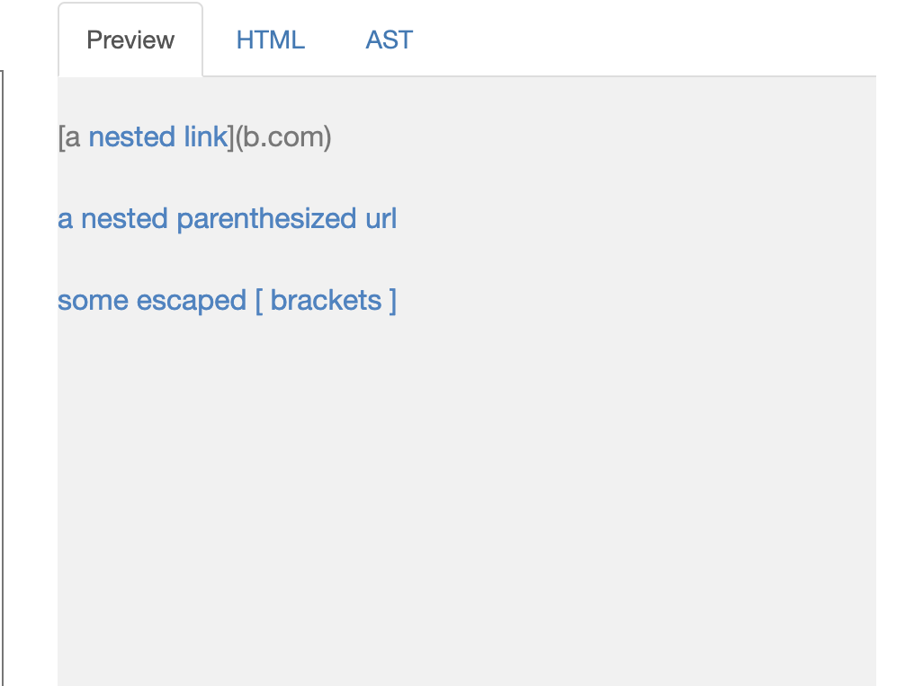
From here I was able to tell that the expected links would be:
```
"a.com()","a.com(())" and "example.com"

```
On both my version of MarkdownParse and the one I reviewed I created this test to see if we got the expected output:

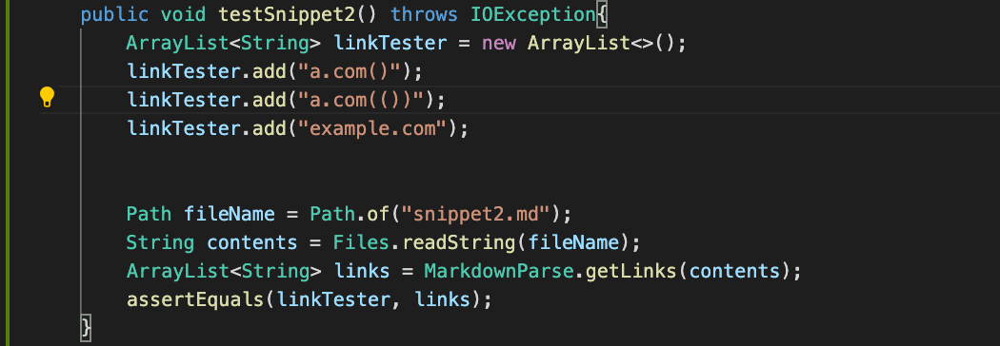


The result for my version of Markdownparse was this and the test failed:
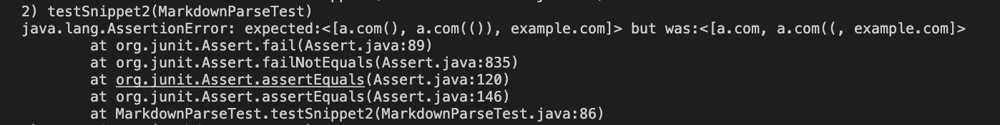


The result for the version I reviewed was and it failed:
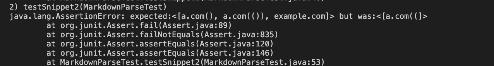

---
Snippet 3
---

For this Snippet I checked what the expected output is which showed:

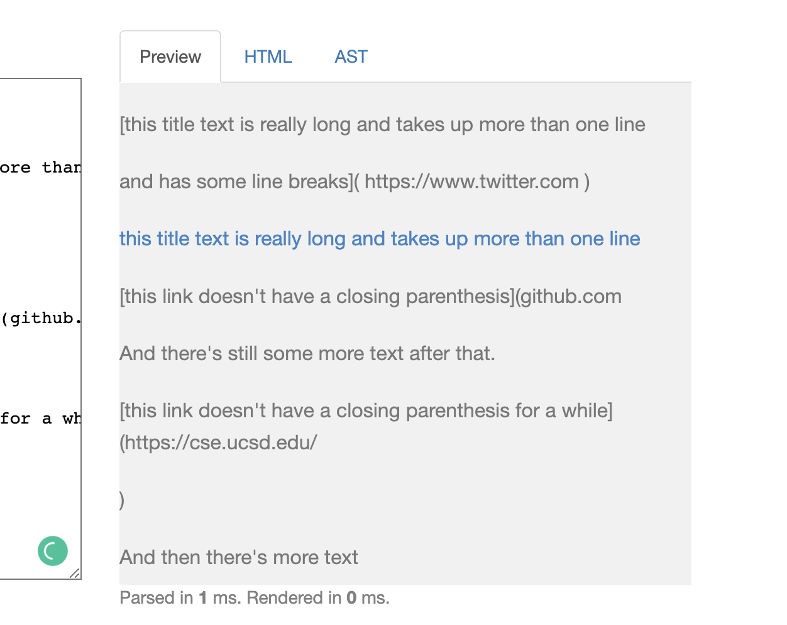
From here I was able to tell that the expected links would be:
```
"https://ucsd-cse15l-w22.github.io/"
```
On both my version of MarkdownParse and the one I reviewed I created this test to see if we got the expected output:

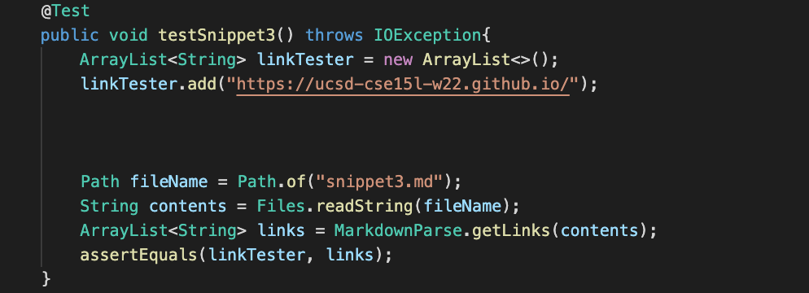

The result for my version of Markdownparse was this and the test failed:
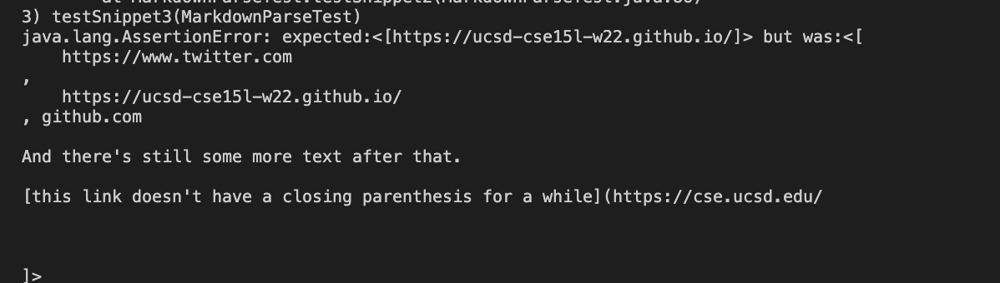

The result for the version I reviewed was this and it failed:
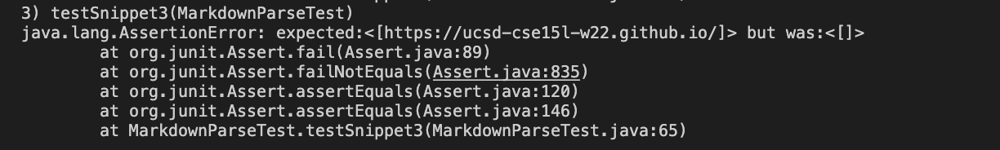

Answers to the following 3 questions:

Question1:

No I do not think there is an easy change that is less than 10 lines that can potentially fix this code. Based on the code that we already have and the answers that were outputted from our code it demonstrates that there would need to be more conditionals to check for more brackets after the first one. Also more would need to be done to see if it a valid link since right now the output was url.com which shouldn't have came out.

Question2:
For this one I also think there should be a more involved  code that  takes longer than 10 lines because of how much went unchecked. Like the code we currently have does not take into considereation parantheses in another set of paranteheses. Also it has the same issue with the brackets.

Question3:
This snippet would also need a more invloved code to fix. For this one there needs to be more code implemented to like skip over the line breaks and make the links work properly because although technically the twitter  link should work but because of the line breaks it doesn't.