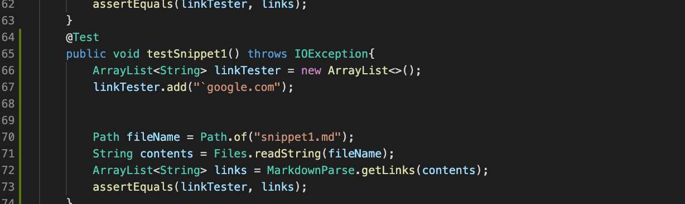

# Lab Report 4
Before  we begin here is the link to my repository of MarkdownParse:
[Melissa MarkdownParse](https://github.com/melissaesantos/markdown-parse)

Here is the link for the MarkdownParse I reviewed:[reviewed MarkdownParse](https://github.com/merrickqiu/markdown-parse)

---
Snippet 1
---

For this Snippet I checked what the expected output is which showed:


From here I was able to tell that the expected links would be:
```
"`google.com"
```
On both my version of MarkdownParse and the one I reviewed I created this test to see if we got the expected output:



For my version of Markdownparse my tester failed and was this:


The result for the version I reviewed this was the result of the tester:


---
Snippet 2
---

For this Snippet I checked what the expected output is which showed:


From here I was able to tell that the expected links would be:
```
"a.com()","a.com(())" and "example.com"

```
On both my version of MarkdownParse and the one I reviewed I created this test to see if we got the expected output:


The result for my version of Markdownparse was this and the test failed:


The result for the version I reviewed this was the result of the tester:
---
Snippet 3
---

For this Snippet I checked what the expected output is which showed:


From here I was able to tell that the expected links would be:
```
"https://ucsd-cse15l-w22.github.io/"
```
On both my version of MarkdownParse and the one I reviewed I created this test to see if we got the expected output:


The result for my version of Markdownparse was this and the test failed:


The result for the version I reviewed was:


