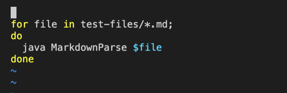
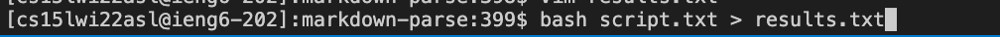
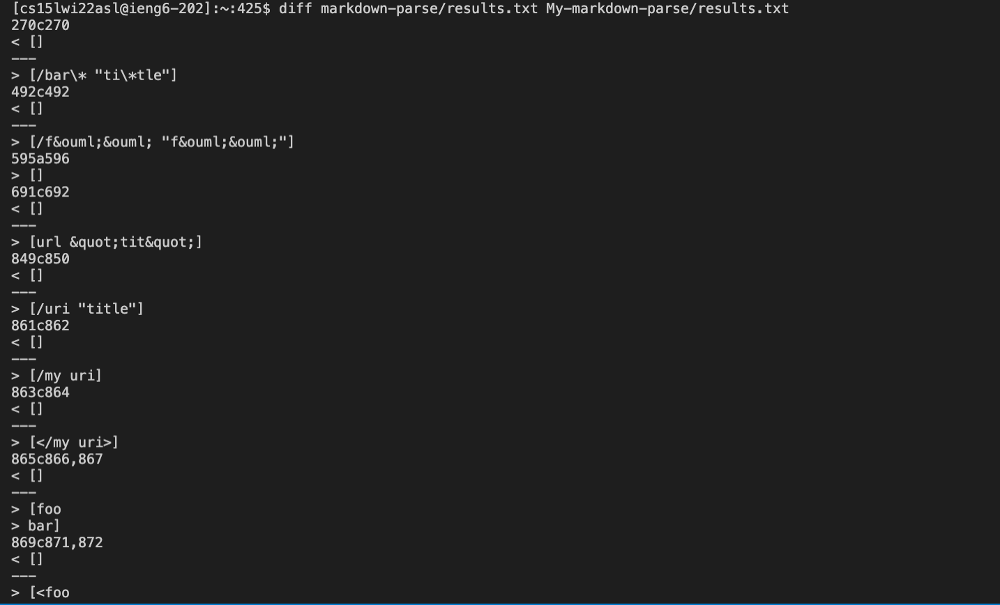
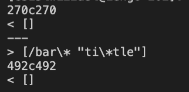
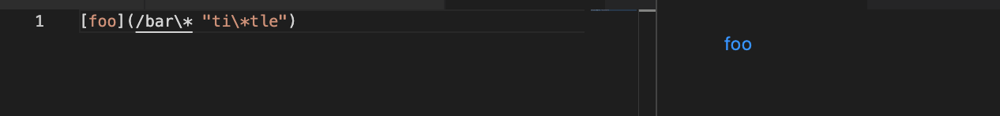
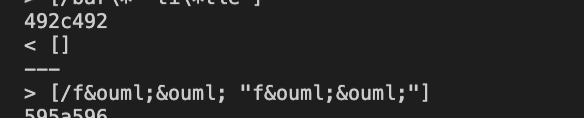
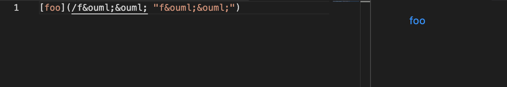
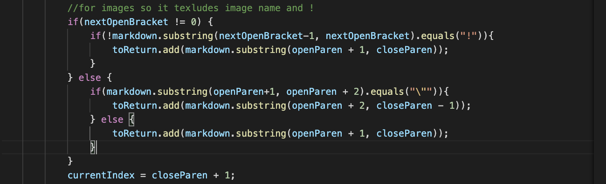

# Lab Report 5

Finding two different results:

To find 2 different results I created a ```script.sh``` file in My-markdown-Parse.
This file contains a for loop which i used to iterate through all of the tests: 



using this I am able to run through all the tests.
I ran this file on both my repository and the class's markdown parse. 

Then I saved the results in results.txt using this and I did this for both repositories:





Now to find the differing test results. I used ```diff``` in a command to compare them which led to this:


 

## 1st bug:


I will be using the bug from line:




- the "270c270" represents the line in the results.txt
- the next line shows the output from My-markdown-parse
- 3rd shows the line in the results.txt from the markdownparse from class
- 4th line shows the output from markdown parse from class

When typing this into preview one can see that this should be a valid link:





Because of this I believe that the output from the mark down parse from class is correct because it gets the valid link ```[/bar\* "ti\*tle"]``` where as mine doesnt produce it.

## 2nd bug


For this 2nd bug we will be going over test 492




- the "492c492" represents the line in the results.txt
- the next line shows the output from My-markdown-parse
- 3rd shows the line in the results.txt from the markdownparse from class
- 4th line shows the output from markdown parse from class

Inputting it into the preview we can see that my markdown parse does not produce the correct result as the expected out put is``` [/f&ouml;&ouml; "f&ouml;&ouml"]```




## The Fix for BUG 1:





I believe here the fix should be to add something similar to what the class code implemented like ```if(potentialLink.indexOf(" ") == -1 ) {}```  I would implement this because of how the link has a space and an asterik so adding this to the pice of code above to check the link that is once it has been returned can potentially fix this and resolve the issue.


##The fix for BUG 2:


The fix for this code should also be somewhat similar to the code above but this time we should be adding more check statements. These check statements should ensure that having different symbols/characters that are not letters do not affect the proper link from being produced and it would produce the correct link like how it did for the class's markdownParse.
